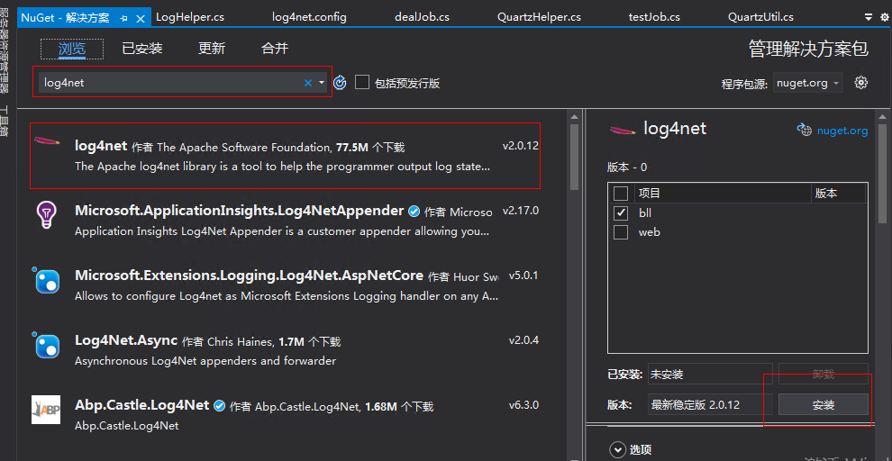
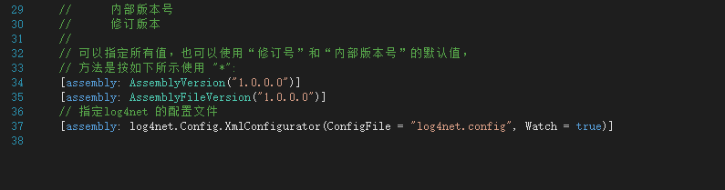
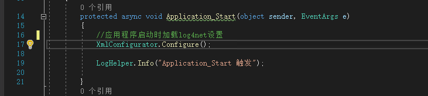
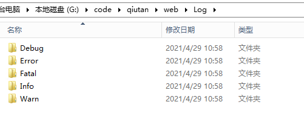

## log4net使用配置

------

1.使用Nuget按照log4net



2.添加log4net.config文件，内容如下：

```c#
<?xml version="1.0" encoding="utf-8"?>
<configuration>
	<system.web>
		<compilation debug="true" targetFramework="4.5" />
		<httpRuntime targetFramework="4.5" />
	</system.web>
	<configSections>
		<section name="log4net" type="log4net.Config.Log4NetConfigurationSectionHandler,log4net-net-1.2" />
	</configSections>
	<!--配置log4net-->
	<log4net>
		<root>
		</root>
		<logger name="RollingLogFileAppender">
			<level value="ALL" />
			<appender-ref ref="RollingFileDebug" />
			<appender-ref ref="RollingFileInfo" />
			<appender-ref ref="RollingFileWarn" />
			<appender-ref ref="RollingFileError" />
			<appender-ref ref="RollingFileFatal" />
		</logger>
		<appender name="RollingFileDebug" type="log4net.Appender.RollingFileAppender">
			<!--文件路径 如果不设置（去掉 value="Log/Debug/"）会默认保存到[App_Data]文件夹中-->
			<param name="File" value="Log/Debug/"/>
			<!--追加到文件-->
			<param name="AppendToFile" value="true"/>
			<!--最多保留的文件数，设为"-1"则不限-->
			<param name="MaxSizeRollBackups" value="10"/>
			<!--写到一个文件-->
			<param name="StaticLogFileName" value="false"/>
			<!--文件名，按日期命名-->
			<param name="DatePattern" value="yyyyMMdd&quot;.log&quot;"/>
			<!--创建日志文件的方式，可选值：Date[日期],文件大小[Size],混合[Composite]-->
			<param name="RollingStyle" value="Date"/>
			<!--日志格式-->
			<layout type="log4net.Layout.PatternLayout">
				<!--%newline输出的日志会换行 [%date{HH:mm:ss fff}]表示记录的时间 -->
				<conversionPattern value="[%date{HH:mm:ss fff}] %- %message%newline" />
				<!--如果想自己设置格式就只需要-->
				<!--<conversionPattern value="%message"/>-->
			</layout>
			<lockingmodel type="log4net.appender.fileappender+minimallock" />
			<filter type="log4net.Filter.LevelRangeFilter">
				<param name="LevelMin" value="Debug" />
				<param name="LevelMax" value="Debug" />
			</filter>
		</appender>
		<appender name="RollingFileInfo" type="log4net.Appender.RollingFileAppender">
			<param name="File" value="Log/Info/"/>
			<param name="AppendToFile" value="true"/>
			<param name="MaxSizeRollBackups" value="10"/>
			<param name="StaticLogFileName" value="false"/>
			<param name="DatePattern" value="yyyyMMdd&quot;.log&quot;"/>
			<param name="RollingStyle" value="Date"/>
			<layout type="log4net.Layout.PatternLayout">
				<conversionPattern value="[%date{HH:mm:ss fff}] %- %message%newline" />
			</layout>
			<lockingmodel type="log4net.appender.fileappender+minimallock" />
			<filter type="log4net.Filter.LevelRangeFilter">
				<param name="LevelMin" value="INFO" />
				<param name="LevelMax" value="INFO" />
			</filter>
		</appender>
		<appender name="RollingFileWarn" type="log4net.Appender.RollingFileAppender">
			<param name="File" value="Log/Warn/"/>
			<param name="AppendToFile" value="true"/>
			<param name="MaxSizeRollBackups" value="10"/>
			<param name="StaticLogFileName" value="false"/>
			<param name="DatePattern" value="yyyyMMdd&quot;.log&quot;"/>
			<param name="RollingStyle" value="Date"/>
			<layout type="log4net.Layout.PatternLayout">
				<conversionPattern value="[%date{HH:mm:ss fff}] %- %message%newline" />
			</layout>
			<lockingmodel type="log4net.appender.fileappender+minimallock" />
			<filter type="log4net.Filter.LevelRangeFilter">
				<param name="LevelMin" value="WARN" />
				<param name="LevelMax" value="WARN" />
			</filter>
		</appender>
		<appender name="RollingFileError" type="log4net.Appender.RollingFileAppender">
			<param name="File" value="Log/Error/"/>
			<param name="AppendToFile" value="true"/>
			<param name="MaxSizeRollBackups" value="10"/>
			<param name="StaticLogFileName" value="false"/>
			<param name="DatePattern" value="yyyyMMdd&quot;.log&quot;"/>
			<param name="RollingStyle" value="Date"/>
			<layout type="log4net.Layout.PatternLayout">
				<conversionPattern value="[%date{HH:mm:ss fff}] %- %message%newline" />
			</layout>
			<lockingmodel type="log4net.appender.fileappender+minimallock" />
			<filter type="log4net.Filter.LevelRangeFilter">
				<param name="LevelMin" value="ERROR" />
				<param name="LevelMax" value="ERROR" />
			</filter>
		</appender>
		<appender name="RollingFileFatal" type="log4net.Appender.RollingFileAppender">
			<param name="File" value="Log/Fatal/"/>
			<param name="AppendToFile" value="true"/>
			<param name="MaxSizeRollBackups" value="10"/>
			<param name="StaticLogFileName" value="false"/>
			<param name="DatePattern" value="yyyyMMdd&quot;.log&quot;"/>
			<param name="RollingStyle" value="Date"/>
			<layout type="log4net.Layout.PatternLayout">
				<conversionPattern value="[%date{HH:mm:ss fff}] %- %message%newline" />
			</layout>
			<lockingmodel type="log4net.appender.fileappender+minimallock" />
			<filter type="log4net.Filter.LevelRangeFilter">
				<param name="LevelMin" value="FATAL" />
				<param name="LevelMax" value="FATAL" />
			</filter>
		</appender>

	</log4net>
</configuration>

```

3.在AssemblyInfo.cs文件中加上下面的配置：

```c#
// 指定log4net 的配置文件
[assembly: log4net.Config.XmlConfigurator(ConfigFile = "log4net.config", Watch = true)]
```



或者在Global.asax.cs中加入配置：

```c#
//应用程序启动时加载log4net设置 
XmlConfigurator.Configure();
```



**到这里全部的配置就好了！！！**

4.添加日志工具栏LogHelper:

```c#
public class LogHelper
    {
        public static readonly ILog Log = LogManager.GetLogger("RollingLogFileAppender");


        //  log4j定义了8个级别的log（除去OFF和ALL，可以说分为6个级别），优先级从高到低依次为：OFF、FATAL、ERROR、WARN、INFO、DEBUG、TRACE、 ALL。 
        //ALL 最低等级的，用于打开所有日志记录。
        //DEBUG 指出细粒度信息事件对调试应用程序是非常有帮助的，主要用于开发过程中打印一些运行信息。 
        //INFO 消息在粗粒度级别上突出强调应用程序的运行过程。打印一些你感兴趣的或者重要的信息，这个可以用于生产环境中输出程序运行的一些重要信息，
        //WARN 表明会出现潜在错误的情形，有些信息不是错误信息，但是也要给程序员的一些提示。
        //ERROR 指出虽然发生错误事件，但仍然不影响系统的继续运行。打印错误和异常信息，如果不想输出太多的日志，可以使用这个级别。
        //FATAL 指出每个严重的错误事件将会导致应用程序的退出。这个级别比较高了。重大错误，这种级别你可以直接停止程序了。

        //TRACE designates finer-grained informational events than the DEBUG.Since:1.2.12，很低的日志级别，一般不会使用。 
        //OFF 最高等级的，用于关闭所有日志记录。
        //如果将log level设置在某一个级别上，那么比此级别优先级高的log都能打印出来。例如，如果设置优先级为WARN，那么OFF、FATAL、ERROR、WARN 4个级别的log能正常输出，而INFO、DEBUG、TRACE、 ALL级别的log则会被忽略。Log4j建议只使用四个级别，优先级从高到低分别是ERROR、WARN、INFO、DEBUG。

        #region DEBUG 指出细粒度信息事件对调试应用程序是非常有帮助的，主要用于开发过程中打印一些运行信息。 
        public static void debug(string write)
        {

            Log.Debug("日志记录:" + write);
        }
        public static void debug(string write, Exception ex)
        {
            Log.Debug("日志记录:" + write + "。错误记载：" + ex.ToString());
        }
        #endregion
        #region INFO 消息在粗粒度级别上突出强调应用程序的运行过程。打印一些你感兴趣的或者重要的信息，这个可以用于生产环境中输出程序运行的一些重要信息，
        /// <summary>
        /// 1
        /// </summary>
        /// <param name="write"></param>
        public static void Info(string write)
        {
            Log.Info("日志记录:" + write);
        }
        public static void Info(string write, Exception ex)
        {
            Log.Info("日志记录:" + write + "。错误记载：" + ex.ToString());
        }
        #endregion
        #region WARN 表明会出现潜在错误的情形，有些信息不是错误信息，但是也要给程序员的一些提示。，可以使用这个级别。
        public static void warn(string write)
        {
            Log.Warn("日志记录:" + write);
        }
        public static void warn(string write, Exception ex)
        {
            Log.Warn("日志记录:" + write + "。错误记载：" + ex.ToString());
        }
        #endregion

        #region ERROR 指出虽然发生错误事件，但仍然不影响系统的继续运行。打印错误和异常信息，如果不想输出太多的日志，可以使用这个级别。
        public static void error(string write)
        {
            Log.Error("日志记录:" + write);
        }
        public static void error(string write, Exception ex)
        {
            Log.Error("日志记录:" + write + "。错误记载：" + ex.ToString());
        }
        #endregion
        #region FATAL 指出每个严重的错误事件将会导致应用程序的退出。这个级别比较高了。重大错误，这种级别你可以直接停止程序了。
        public static void fatal(string write)
        {
            Log.Fatal("日志记录:" + write);
        }
        public static void fatal(string write, Exception ex)
        {
            Log.Fatal("日志记录:" + write + "。错误记载：" + ex.ToString());
        }
        //#endregion


        #endregion


        //定义输出的日志内容
        //public static string logMessage(SysLogMsg logMessage)
        //{
        //    StringBuilder strInfo = new StringBuilder();
        //    strInfo.Append("\r\n1. 错误: >> 操作时间: " + logMessage.OperationTime + " 操作人: " + logMessage.UserName + " \r\n");
        //    strInfo.Append("2. 类名: " + logMessage.Class + " \r\n");
        //    strInfo.Append("3. 内容: " + logMessage.Content + "\r\n");
        //    strInfo.Append("-----------------------------------------------------------------------------------------------------------------------------\r\n");
        //    return strInfo.ToString();
        //}
    }
```

记录日志格式如下：

