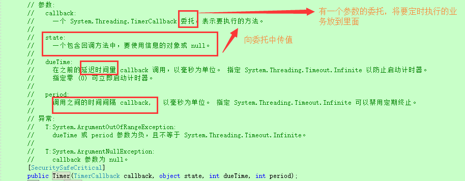
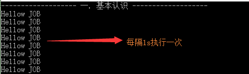
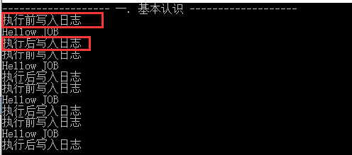

## 第一节: Timer的定时任务的复习、Quartz.Net的入门使用、Aop思想的体现

------

一. 前奏-Timer类实现定时任务

 　在没有引入第三方开源的定时调度框架之前，我们处理一些简单的定时任务同时都是使用Timer类， DotNet中的Timer类有三个，分别位于不同的命名空间下，分别是：

　　　　①.位于System.Windows.Forms里,即定时器控件，不过多介绍了

　　　　②.位于System.Threading.Timer类里 （重点介绍）

　　　　③.位于System.Timers.Timer类里 (不介绍)

　　下面重点介绍第二种，位于Threading下面的Timer类，观察其源码，发现有多种构造函数，我们重点介绍其中的一种。

 

　　分享一段代码：2秒后开启该线程，然后每隔4s调用一次。

```c#
1           //2秒后开启该线程，然后每隔4s调用一次
2             System.Threading.Timer timer = new System.Threading.Timer((n) =>
3             {
4                 //书写业务逻辑
5                 Console.WriteLine("我是定时器中的业务逻辑哦{0}",n);
6             }, "1", 2000, 4000);
```

 　**分析总结：上面的代码显而易见，只能控制：延迟多久开始执行，每隔多久执行一次，至于执行多少次、什么时间关闭均无法实现，更不用说处理一些复杂的时间间隔了，所以Timer类仅仅适合处理对时间要求非常简单的定时任务。**

 

二. 进入主题-Quartz.Net的入门使用

> **使用步骤：**
>
> 　　**前提：通过NuGet引入程序集或者直接下载源码进行引入，然后分五步走。**
>
> 　　步骤一：创建作业调度池(Scheduler)
>
> 　　步骤二：创建一个具体的作业即job (具体的job需要单独在一个文件中执行)
>
> 　　步骤三：创建并配置一个触发器即trigger
>
> 　　步骤四：将job和trigger加入到作业调度池中
>
> 　　步骤五：开启调度

 下面分享一段简单的代码（立即执行、每隔一秒执行一次、永久执行）

[](javascript:void(0);)

```c#
 1        /// <summary>
 2         /// Quartz框架的使用
 3         /// </summary>
 4         public static void Show()
 5         {
 6             //1.创建作业调度池(Scheduler)
 7             IScheduler scheduler =StdSchedulerFactory.GetDefaultScheduler();
 8            
 9             //2.创建一个具体的作业即job (具体的job需要单独在一个文件中执行)
10             var job = JobBuilder.Create<HelloJob>().Build();
11 
12             //3.创建并配置一个触发器即trigger   1s执行一次
13             var trigger = TriggerBuilder.Create().WithSimpleSchedule(x => x.WithIntervalInSeconds(1)
14                                                                            .RepeatForever()).Build();
15             //4.将job和trigger加入到作业调度池中
16             scheduler.ScheduleJob(job, trigger);
17 
18             //5.开启调度
19             scheduler.Start();
20         }
```

[](javascript:void(0);)

[](javascript:void(0);)

```c#
 1     /// <summary>
 2     /// 实现IJob接口
 3     /// </summary>
 4     class HelloJob : IJob
 5     {
 6         void IJob.Execute(IJobExecutionContext context)
 7         {
 8             Console.WriteLine("Hellow JOB");
 9         }
10     }
```

[](javascript:void(0);)

　　**分析：每个Job都需要实现IJob接口，并且显式的实现Execute方法；创建调度器除了上述方法外，还可以：**

```c#
1   //另外一种创建调度池的方法
2   var factory = new StdSchedulerFactory();
3   IScheduler scheduler2 = factory.GetScheduler();
```

　　执行结果：

 

三. 扩展-Aop思想的体现

 　我们想在每次Job执行的前后，分别执行一段通用的业务，但有不想和原业务写在一起，这个时候就需要面向切面编程了，即AOP思想的体现。

 　Quartz.Net中Aop思想通过JobListener来实现，代码如下：

[](javascript:void(0);)

```c#
 1         /// <summary>
 2         /// Quartz中的AOP思想
 3         /// </summary>
 4         public static void AopShow()
 5         {
 6             //1.创建Schedule
 7             IScheduler scheduler = StdSchedulerFactory.GetDefaultScheduler();
 8             
 9             //2.创建job (具体的job需要单独在一个文件中执行)
10             var job = JobBuilder.Create<HelloJob>().Build();
11 
12             //3.配置trigger   1s执行一次
13             var trigger = TriggerBuilder.Create().WithSimpleSchedule(x => x.WithIntervalInSeconds(1)
14                                                                            .RepeatForever()).Build();
15             //AOP配置
16             scheduler.ListenerManager.AddJobListener(new MyAopListener(), GroupMatcher<JobKey>.AnyGroup());
17 
18             //4.将job和trigger加入到作业调度池中
19             scheduler.ScheduleJob(job, trigger);
20 
21             //5. 开始调度
22             scheduler.Start();
23         }
24     /// <summary>
25     /// Aop类
26     /// </summary>
27     public class MyAopListener : IJobListener
28     {
29         public string Name
30         {
31             get
32             {
33                 return "hello world";
34             }
35         }
36         public void JobExecutionVetoed(IJobExecutionContext context)
37         {
38 
39         }
40         public void JobToBeExecuted(IJobExecutionContext context)
41         {
42             Console.WriteLine("执行前写入日志");
43         }
44         public void JobWasExecuted(IJobExecutionContext context, JobExecutionException jobException)
45         {
46             Console.WriteLine("执行后写入日志");
47         }
48     }
```

[](javascript:void(0);)

　　**执行结果：**

 

 

 