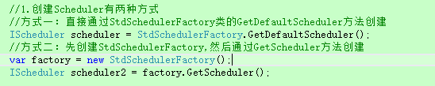
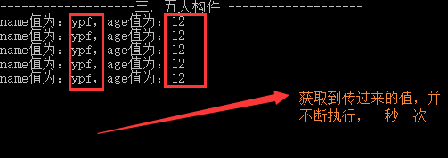

## 第三节: Quartz.Net五大构件之Scheduler(创建、封装、基本方法等)和Job(创建、关联等)

------

一. 五大构件

> **引言：** Quartz.Net的五大构件
>
> 　　1.  调度器：Scheduler
>
> 　　2.  作业任务：Job
>
> 　　3.  触发器： Trigger
>
> 　　4.  线程池： SimpleThreadPool
>
> 　　5.  作业持久化：JobStore
>
>  

 二. Scheduler详解

**1. 创建Scheduler的两种方式**

　　(1). 直接通过StdSchedulerFactory类的GetDefaultScheduler方法创建

　　(2). 先创建StdSchedulerFactory,然后通过GetScheduler方法创建. 该方式可以在实体化StdSchedulerFactory的时候配置一些额外的信息，比如：配置SimpleThreadPool的个数、RemoteScheduler的远程控制、数据库的持久化等。(都在后续章节介绍)



**2. Scheduler的简单封装**

　　这里提供两种思路，一种是单例的模式封装，另一种是利用线程槽的模式封装

　　(1). 单例模式：是指无论多少个用户访问，都只有一个实例，在web端上常用 （详见：MySchedulerFactory类）

　　(2). 线程槽模式：是指单个用户的单次链接，在未断开连接之前，只有一个实例，下次重新连接，实例将重新创建（详见：MySchedulerFactory2类）

**代码分享：**

[](javascript:void(0);)

```c#
 1     /// <summary>
 2     /// 将Sheduler封装成单例模式，解决多线程多用户不唯一的问题
 3     /// </summary>
 4     public class MySchedulerFactory
 5     {
 6         /// <summary>
 7         /// 静态变量：由CLR保证，在程序第一次使用该类之前被调用，而且只调用一次
 8         /// </summary>
 9         private static IScheduler _Scheduler = StdSchedulerFactory.GetDefaultScheduler();
10         public static IScheduler CreateScheduler()
11         {
12             return _Scheduler;
13         }
14     }
15     /// <summary>
16     /// 通过线程槽进行一个优化
17     /// </summary>
18     public class MySchedulerFactory2
19     {
20         public static IScheduler CreateScheduler()
21         {
22             IScheduler scheduler = CallContext.GetData(typeof(MySchedulerFactory2).Name) as IScheduler;
23             if (scheduler == null)
24             {
25                 scheduler = StdSchedulerFactory.GetDefaultScheduler();
26                 CallContext.SetData(typeof(MySchedulerFactory2).Name, scheduler);
27             }
28             return scheduler;
29         }
30     }
```

[](javascript:void(0);)

**3. Scheduler的基本方法：**

(1). 开启：Start

(2). 关闭：ShutDown

(3). 暂停job或Trigger：PauseAll、PauseJob、PauseJobs、PauseTrigger、PauseTriggers

(4). 恢复job或Trigger：ResumeAll、ResumeJob、ResumeJobs、ResumeTrigger、ResumeTriggers

(5). 将job和trigger加入Scheduler中：ScheduleJob

(6). 添加Job：AddJob

　　**PS：更多方法以及如何封装使用，将在后面的框架章节介绍**

 **分享一段完成的代码：**

 View Code

 

三. Job详解

**1. 几个类型**

　　①. JobBuilder：用来创建JobDetail。

　　②. IJob：具体作业任务需要实现该接口，并实现里面的方法

　　③. IJobDetail：用来定义工作实例

**2. job的创建有两种形式：**

　　①.Create的泛型方式：写起来代码简洁方便。

　　②.反射+OfType的方式：用于后期动态绑定，通过程序集的反射

[](javascript:void(0);)

```c#
 1              //1 (Create的泛型方式)
 2             IJobDetail job1 = JobBuilder.Create<HelloJob2>()
 3                     .UsingJobData("name", "ypf")
 4                     .UsingJobData("age", "12")
 5                     .WithIdentity("job1", "myJob1")
 6                     .WithDescription("我是用来对该job进行描述的")
 7                     .StoreDurably(true)
 8                     .Build();
 9 
10             //2 (反射+OfType的方式)
11             //通过反射来创建类
12             var type = Assembly.Load("QuartzDemo").CreateInstance("QuartzDemo.HelloJob2");
13             //OfType的方式加载类型
14             IJobDetail job2 = JobBuilder.Create().OfType(type.GetType())
15                                     .UsingJobData("name", "ypf")
16                                     .UsingJobData("age", "12")
17                                     .StoreDurably(true)
18                                     .Build();
```

[](javascript:void(0);)

**3.常用的几个方法**

　　①.UsingJobData：给Job添加一些附加值，存储在JobDataMap里，可以在具体的Job中获取。（通过context.JobDetail.JobDataMap获取）

　　②.StoreDurably：让该job持久化，不被销毁.(默认情况下为false，即job没有对应的trigger的话，job就被销毁)

　　③.WithIdentity：身份标记，给job起个名称，便于和Trigger关联的时候使用.

　　④.WithDescription：用来对job进行描述，并没有什么实际作用

**分享完整代码：**

[](javascript:void(0);)

```c#
       /// <summary>
        /// Job详解
        /// </summary>
        public static void JobShow()
        {
            //1. 创建Schedule
            IScheduler scheduler = StdSchedulerFactory.GetDefaultScheduler();
            
            //2. 创建Job
            //2.1 (Create的泛型方式)
            IJobDetail job1 = JobBuilder.Create<HelloJob2>()
                    .UsingJobData("name", "ypf")
                    .UsingJobData("age", "12")
                    .WithIdentity("job1", "myJob1")
                    .WithDescription("我是用来对该job进行描述的")
                    .StoreDurably(true)
                    .Build();

            //2.2 (反射+OfType的方式)
            //通过反射来创建类
            var type = Assembly.Load("QuartzDemo").CreateInstance("QuartzDemo.HelloJob2");
            //OfType的方式加载类型
            IJobDetail job2 = JobBuilder.Create().OfType(type.GetType())
                                    .UsingJobData("name", "ypf")
                                    .UsingJobData("age", "12")
                                    .StoreDurably(true)
                                    .Build();
            IJobDetail job3 = JobBuilder.Create(type.GetType())
                                 .UsingJobData("name", "ypf")
                                 .UsingJobData("age", "12")
                                 .StoreDurably(true)
                                 .Build();

            //3. 创建Trigger
            ITrigger trigger = TriggerBuilder.Create().WithSimpleSchedule(x => x.WithIntervalInSeconds(1).RepeatForever()).Build();

            //4. 将Job和Trigger加入调度器中
            //scheduler.ScheduleJob(job1, trigger);
            //scheduler.ScheduleJob(job2, trigger);
            scheduler.ScheduleJob(job3, trigger);

            //5. 开始调度
            scheduler.Start();
        }
     /// <summary>
    /// 实现IJob接口
    /// </summary>
    class HelloJob2 : IJob
    {
        void IJob.Execute(IJobExecutionContext context)
        {
            var name = context.JobDetail.JobDataMap["name"];
            var age = context.JobDetail.JobDataMap["age"];

            Console.WriteLine("name值为：{0}，age值为：{1}", name, age);
        }
    }
```

[](javascript:void(0);)

**运行结果：**



\4. Job和触发器关联的形式：1对1、1对多、多对1

 **（PS：在下面Trigger处详细介绍）**