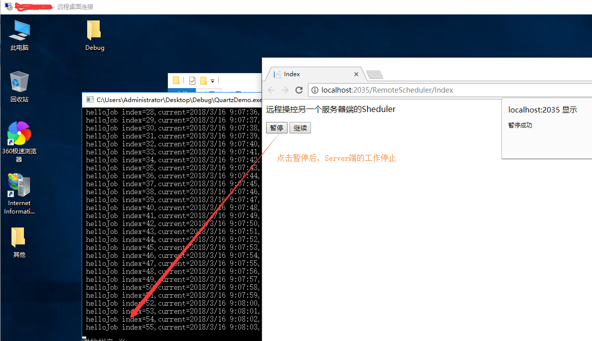
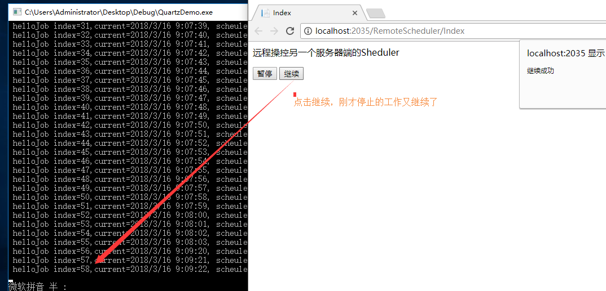

## 第九节: 利用RemoteScheduler实现Sheduler的远程控制

------

一. RemoteScheduler远程控制

**1. 背景**： 在A服务器上部署了一个Scheduler，我们想在B服务器上控制这个Scheduler。

**2. 猜想**： A服务器上的Scheduler需要有地址、需要有端口、需要有名称(实际上也是如此)。

**3. 需求**： 一个控制台程序作为服务端运行A服务器上（也可以部署成服务），用另一个B服务器上的Web端控制来控制这个Scheduler的暂停、继续等操作。

**4. 具体实现**：

　　①：A服务器上的Server端的Scheduler需要配置port和bindName两个核心参数，用来对外公开。

　　②：B服务器上Client端的Scheduler的创建需要使用代理，并配置其地址（A服务器上对外公开的）。

**(原理：通过代理获取A服务器中的Scheduler，然后获取里面的job和trigger，然后可以配置job和trigger的开启、关闭、编辑等，这里以操控job的暂停和继续为例，介绍其使用思路，详细的如何操控trigger或者编辑等，详解后面框架章节)**

 **代码分享：**

**(1). A服务器上，即被控制端的Server端，这里我们用控制台程序代替。**

　 **(PS:核心点就是StdSchedulerFactory类需要配置 type、port、bindName )**

[](javascript:void(0);)

```c#
 1  public class RemoteSchedulerServer
 2     {
 3         public static void ShowRemoteScheduler()
 4         {
 5             //1. 配置调度器工厂
 6             var schedulerFactory = new StdSchedulerFactory(new NameValueCollection()
 7             {
 8                 {"quartz.scheduler.exporter.type","Quartz.Simpl.RemotingSchedulerExporter,Quartz" },
 9                 {"quartz.scheduler.exporter.port","5555" },
10                 {"quartz.scheduler.exporter.bindName","QuartzScheduler" },
11             });
12             //2. 创建调度器
13             var scheduler = schedulerFactory.GetScheduler();
14             //3. 配置job和trigger并开启
15             var job = JobBuilder.Create<HelloJob4>()
16                 .WithIdentity("myJob1", "jobGroup1")
17                 .Build();
18             var trigger = TriggerBuilder.Create()
19                 .WithIdentity("myJobTrigger1", "triggerGroup1")
20                 .StartNow()
21                 .WithCronSchedule("/1 * * ? * *")
22                 .Build();
23             scheduler.ScheduleJob(job, trigger);
24             scheduler.Start();
25         }
26     }
```

[](javascript:void(0);)

**(2). B服务器，即Client端，用来操控A服务器上Scheduler，下面的代码我在操控job暂停和继续的时候，直接把jobName和GroupName写死了，这里只是为了演示用法而已，实际上可以通过远程代理创建的scheduler来获取所有的job和trigger的。**

 **(PS:核心点就是StdSchedulerFactory类需要配置 代理，并配置代理地址，即A服务器的地址、port、bindName )**

[](javascript:void(0);)

```c#
 1  public class RemoteSchedulerController : Controller
 2     {     
 3         /// <summary>
 4         /// 前端页面
 5         /// </summary>
 6         /// <returns></returns>
 7         public ActionResult Index()
 8         {
 9             return View();
10         }
11         /// <summary>
12         /// 使用代理的方式创建Sheduler
13         /// </summary>
14         static IScheduler scheduler = null;
15         public RemoteSchedulerController()
16         {
17             var schedulerFactory = new StdSchedulerFactory(new System.Collections.Specialized.NameValueCollection()
18             {
19                  {"quartz.scheduler.proxy","true" },  //使用代理
20                  {"quartz.scheduler.proxy.Address","tcp://localhost:5555/QuartzScheduler" }    //Server端的地址是多少，localhost就是多少
21             });
22             scheduler = schedulerFactory.GetScheduler();
23             scheduler.Start();
24         }
25         /// <summary>
26         /// 暂停Job 
27         /// （这里直接从前端默认把名称传过来，实际可以从scheduler中拿到）
28         /// </summary>
29         /// <returns></returns>
30         public ActionResult PauseJob(string jobName, string groupName)
31         {
32             try
33             {
34                 scheduler.PauseJob(new JobKey(jobName, groupName));
35                 return Content("ok");
36             }
37             catch (Exception)
38             {
39 
40                 return Content("error");
41             }
42             
43         }
44         /// <summary>
45         /// 恢复Job
46         /// </summary>
47         /// <returns></returns>
48         public ActionResult ResumeJob(string jobName, string groupName)
49         {
50             try
51             {
52                 scheduler.ResumeJob(new JobKey(jobName, groupName));
53                 return Content("ok");
54             }
55             catch (Exception)
56             {
57 
58                 return Content("error");
59             }
60         }
61     }
```

[](javascript:void(0);)

[](javascript:void(0);)

```c#
 1 <html>
 2 <head>
 3     <meta name="viewport" content="width=device-width" />
 4     <title>Index</title>
 5     <script src="~/Scripts/jquery-1.10.2.min.js"></script>
 6     <script>
 7         $(function () {
 8             //1. 暂停
 9             $("#btn1").on("click", function () {
10                 $.post("PauseJob", { "jobName": "myJob1", "groupName": "jobGroup1" }, function (data) {
11                     if (data=="ok") {
12                         alert("暂停成功");
13                     } else {
14                         alert("失败了");
15                     }
16                 });
17             });
18             //2. 继续
19             $("#btn2").on("click", function () {
20                 $.post("ResumeJob", { "jobName": "myJob1", "groupName": "jobGroup1" }, function (data) {
21                     if (data == "ok") {
22                         alert("继续成功");
23                     } else {
24                         alert("失败了");
25                     }
26                 });
27             });
28         });
29     </script>
30 </head>
31 <body>
32     <div>
33         远程操控另一个服务器端的Sheduler
34     </div>
35     <p></p><p></p><p></p>
36     <button id="btn1">暂停</button>
37     <button id="btn2">继续</button>
38 </body>
39 </html>
```

[](javascript:void(0);)

**(3). 运行结果**

 



 