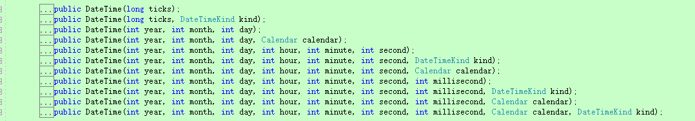
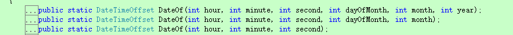
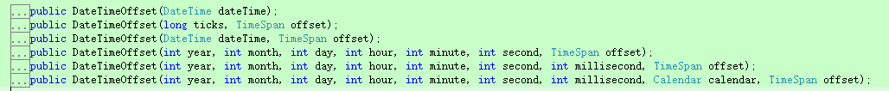

## 第二节：比较DateTime和DateTimeOffset两种时间类型并介绍Quartz.Net中用到的几类时间形式(定点、四舍五入、倍数、递增)

------

一. 时间的类型

 \1. 背景

 　这里为什么要介绍时间类型呢，明明是定时调度篇，原因是在定时任务中，任务什么时间开始执行，什么时间结束执行，要用到各种各样的时间模式，虽然这不能算是一个复杂的问题，但在正式介绍Quartz.Net之前，还是很有必要补充一下的，该章节就是解决这类问题的。

 \2.  时间类型

　　时间类型主要有两类：DateTime和DateTimeOffset

   (详情参考：https://docs.microsoft.com/zh-cn/dotnet/standard/datetime/choosing-between-datetime)

 (1). DateTime：表示的时区有限，国内采用这个时间。

 (2). DateTimeOffset：可以表示任何时区，通过偏移量来控制。**（Quartz中提供DateBuilder类来实现DateTimeOffset类型）**

\3. 类型转换

 (1). DateTime→DateTimeOffset 利用DateTimeOffset的构造函数

 (2). DateTimeOffset→DateTime 利用Convert.ToDateTime方法

 **下面分享一段两种类型相互转换的代码：**

[](javascript:void(0);)

```c#
1 // DateTime类型
2 DateTime date1 = DateTime.Parse("2018-01-01 11:45:30");
3 //DateTimeOffset类型
4 DateTimeOffset date3 = DateBuilder.DateOf(11, 45, 30, 1, 1, 2018);
5 //1. DateTime 转换成 DateTimeOffset
6 DateTimeOffset date16 = new DateTimeOffset(date1, TimeSpan.Zero);
7 //2. DateTimeOffset 转换成 DateTime
8 DateTime date17 = Convert.ToDateTime(date3);
```

[](javascript:void(0);)

二. 各种模式的表示

**(一). 定点模式**

\1. 需求：

　　a. 2018-01-01 11:45:30

　　b. 01-01 1:45:30

　　c. 1:45:30

\2. 解决方案

(1). DateTime类

　　a. 利用DateTime.Parse()进行转换，如：DateTime.Parse("2018-01-01 11:45:30");

　　b. 利用DateTime类丰富的构造函数来执行, 如：new DateTime(2018, 1, 1, 11, 45, 30);



(2). DateTimeOffset类

　　a. 利用DateBuilder.DateOf()进行转换，如：DateBuilder.DateOf(11, 45, 30, 1, 1, 2018);



　　b. 利用DateTimeOffset类丰富的构造函数来执行, 如： new DateTimeOffset(2018, 1, 1, 11, 45, 30, TimeSpan.Zero);



　　c. 另外,DateBuilder类还提供 TodayAt和TomorrowAt类，便于在当前年月日的基础上进行处理

代码分享：

 

[](javascript:void(0);)

```c#
1             DateTime date1 = DateTime.Parse("2018-01-01 11:45:30");
2             DateTime date2 = new DateTime(2018, 1, 1, 11, 45, 30);
3             DateTimeOffset date3 = DateBuilder.DateOf(11, 45, 30, 1, 1, 2018);
4             DateTimeOffset date4 = new DateTimeOffset(2018, 1, 1, 11, 45, 30, TimeSpan.Zero);
5             //默认为当前年月日
6             DateTimeOffset date5 = DateBuilder.TodayAt(1, 45, 30);
7             //默认为当前年月日的基础上 + 1天
8             DateTimeOffset date6 = DateBuilder.TomorrowAt(1, 45, 30);
```

[](javascript:void(0);)

**(二). 四舍五入的模式**

\1. 需求：1:45:30 → 2:00:00

　　　　　　　　→ 1:00:00

\2. 解决方案：

　　(1).DateBuilder.EvenHourDate 在小时的基础上进行“入”

　　(2).DateBuilder.EvenHourDateBefore 在小时的基础上进行“舍”

　　(3).另外在分钟的基础上进行入和舍有： EvenMinuteDate和EvenMinuteDateBefore

　　   在秒钟的基础上进行入和舍有： EvenSecondDate和EvenSecondDateBefore

 代码分享：

```c#
1 DateTimeOffset date5 = DateBuilder.TodayAt(1, 45, 30);
2 DateTimeOffset date7 = DateBuilder.EvenHourDate(date5);           //当前年月日下：2:00:00
3 DateTimeOffset date8 = DateBuilder.EvenHourDateBefore(date5);     //当前年月日下：1:00:00
```

**(三). 倍数模式(不常用)**

\1. 包括：NextGivenMinuteDate和NextGivenSecondDate

　　以NextGivenMinuteDate为例，说明它的用法，NextGivenSecondDate与他类似

　　查看源码：public static DateTimeOffset NextGivenMinuteDate(DateTimeOffset? date, int minuteBase);

第一个参数：可以为空，也可以指定时间

第二个参数：把一个小时按minuteBase分钟进行划分，也就是60/minuteBase等份，真正的运行时间所在区间的下一个minuteBase分钟运行，

(PS：比如minuteBase=20，那么就是将分钟划分为3等分，分别是：20、40、60, 比如现在分钟是在 0-19分59秒，任何一个都会变为 20分00秒)

\2. 用法：第一个参数为空的话，取的是当前时间为依据。

　　　　第一个参数有值的话，是以第一个参数为依据。

代码分享：

```c#
 //以当前时间为依据，假设当前时间为：14:43:29   d9=14:50:00    d10=15:00:00           DateTimeOffset d9 = DateBuilder.NextGivenMinuteDate(null, 10);   
DateTimeOffset d10 = DateBuilder.NextGivenMinuteDate(null, 20);  
 //以第一个参数为依据
DateTimeOffset date9 = DateBuilder.NextGivenMinuteDate(DateBuilder.TodayAt(1, 45, 30), 10);    //50分  秒数为0
DateTimeOffset date10 = DateBuilder.NextGivenMinuteDate(new DateTime(2018, 1, 1, 11, 25, 30), 20);  //40分 秒数为0
```

**(四). 递增模式**

\1. 需求：解决在某个时间点上增加：秒、分、分钟、小时、或天、月等。

\2. 解决方案：

　　利用DateTime类中的各种Add函数来解决。

　　常用方法有：AddSeconds、AddMinutes、AddHours、AddDays、AddMonths

 代码分享：

```c#
1 DateTime date1 = DateTime.Parse("2018-01-01 11:45:30");
2 DateTime date11 = date1.AddSeconds(1);     //2018-01-01 11:45:31
3 DateTime date12 = date1.AddMinutes(1);     //2018-01-01 11:46:30
4 DateTime date13 = date1.AddHours(1);       //2018-01-01 12:45:30
5 DateTime date14 = date1.AddDays(1);        //2018-01-02 11:45:30
6 DateTime date15 = date1.AddMonths(1);      //2018-02-01 11:45:30            
```

 