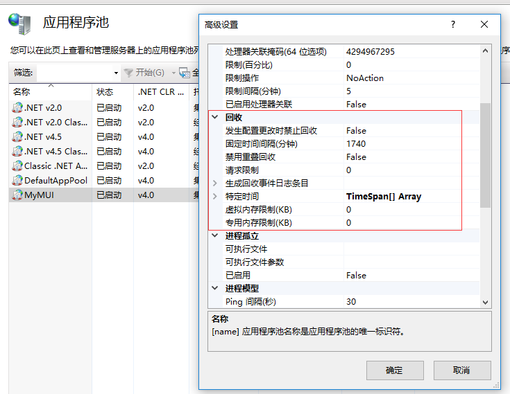
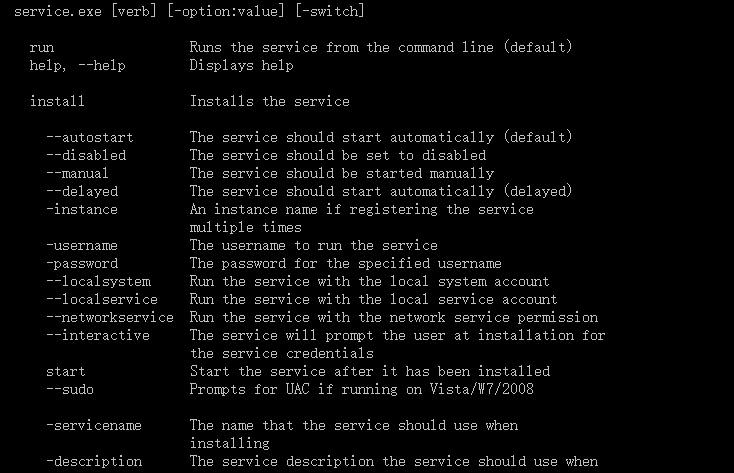
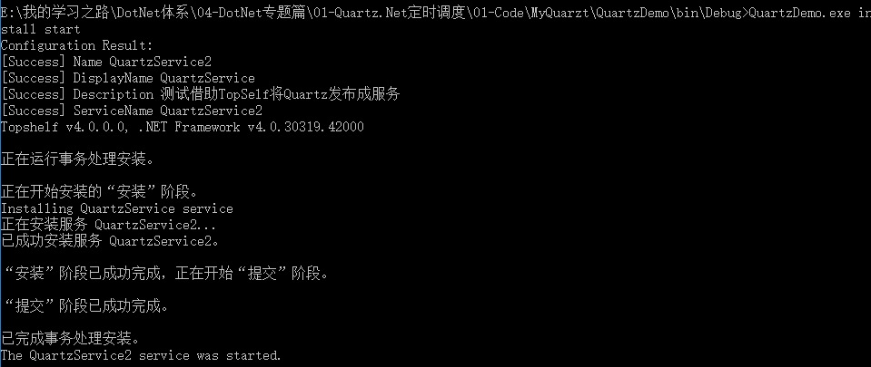
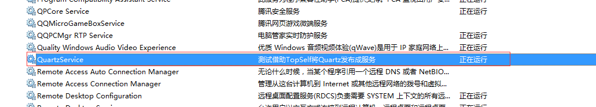
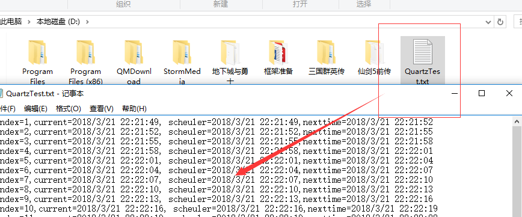
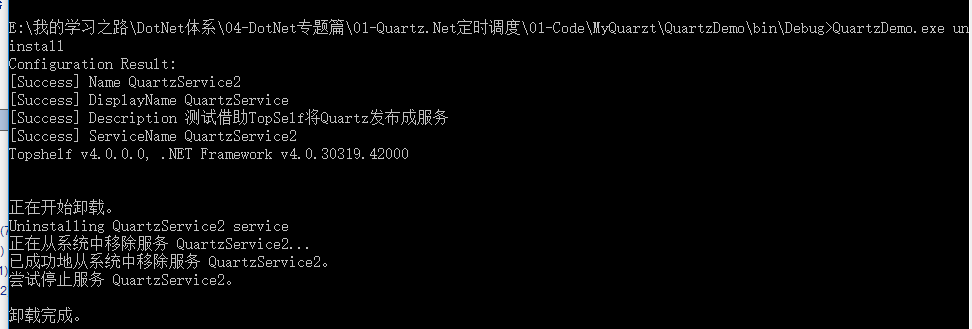

## 第十二节: 总结Quartz.Net几种部署模式(IIS、Exe、服务部署【借助TopSelf、服务类】）

------

一. IIS部署

　　比如在MVC框架中集成了Quartz.Net定时调度，此时该调度系统会随着MVC框架被挂在IIS下，IIS会进程回收，所以大部分开发都会遇到Quartz挂在IIS下一段时间不好用。

　　**补充：IIS可以设置定时自动回收，默认回收是1740分钟，也就是29小时。IIS自动回收相当于服务器IIS重启，应用程序池****内存清空，所有数据被清除，相当于IIS重启，在度量快速开发平台服务器端，为了减小数据库负担，内存中暂存了很多信息，不适合频繁的回收，因为回收会造成服务器端所有存在内存中的数据丢失，如果没有及时保存到数据库中，可能导致程序出现问题。而如果系统使用高峰时期，并不适合回收，回收可能导致几十秒IIS无响应，对于正在工作的人员来说，是一种很不好的体验，会以为是网络或者掉线等问题。**

　　**解决方案：关闭该项目在IIS上对应的进程池的回收机制。**

　　**如何关闭进程池的回收机制：选中IIS中部署的项目对应的进程池，点击【高级设置】，里面有5个核心参数：**

　　　　① 发生配置更改时禁止回收：如果为True,应用程序池在发生配置更改时将不会回收。

　　　　② 固定时间间隔（分钟）：超过设置的时间后，应用程序池回收，设置为：0 意味着应用程序池不回收。系统默认设置的时间是1740（29小时）。

　　　　③ 禁用重叠回收：如果为true，将发生应用程序池回收，以便在创建另一个工作进程之前退出现有工作进程

　　　　④ 请求限制：应用程序池在回收之前可以处理的最大请求数。如果值为0，则表示应用程序池可以处理的请求数没有限制。

　　　　⑤ 生成回收事件日志条目：每发生一次指定的回收事件时便产生一个事件日志条目。



 　 **总结：即使可以将IIS进程池回收关掉，仍然不建议把Quartz挂到IIS下，长时间不回收，会存在内存溢出的问题。**

 

二. C/S程序直接运行

　　我们可以用控制台的形式或者Winform的形式单独做一套定时调度系统，与主框架分类，也便于维护，可以直接将exe程序或者Winform窗体程序在服务器上运行。

　　**总结：该方法不存在回收的问题，但直接在服务器上运行,容易不小心被运维人员关掉了。**

　　对于专业一点的人员来说，该方案，直接运行程序太Low了，所以通常是将exe程序发不成windows服务，通过服务的开启和关闭来 维护。

 

三. 借助topshelf来进行的windows服务部署 

　　官网:http://topshelf-project.com/ ， 这是一种通用的发布服务的方式，步骤如下：

　　1. 通过NuGet下载 Topshelf 的程序集

　　2. 配置QuartzService类，充当定时任务的服务端程序

　　　　①：构造函数中执行定时调度任务

　　　　②：Start()方法控制调度的开启 （必填）

　　　　③：Stop()方法控制调度的关闭 （必填）

　　　　④：Pause()方法暂停调度 （选填）

　　　　⑤：Continue()方法继续调度 （选填）

　　　　⑥：Shutdown() 关闭 (需要支持)

　　3. 在主程序中通过topshelf代码调用： HostFactory.Run 详见主程序。（**在里面可以设置服务的名称、描述等**）

　　4. 通过指令进行服务发布和卸载（查看windows服务：services.msc）

　　　①：通过cmd命令定位到bin文件目录下（以管理员身份运行）

　　　　（eg： 先输入 d： 切换到D盘，再执行下面的命令 cd D:\06-我的开发之路\DotNet体系\04-DotNet专题篇\01-Quartz.Net定时调度\01-Code\MyQuarzt\QuartzDemo\bin\Debug ）

　　　②：QuartzDemo.exe help： 查看指令

　　　　　QuartzDemo.exe install： 安装服务

　　　　　QuartzDemo.exe install start ： 安装服务且开启

　　　　　QuartzDemo.exe uninstall ：卸载服务

　　截止此处，大功告成，可以看到D盘中多了一个txt文件，每隔3s多一条数据

 **下面分享整个过程的代码部署的相应截图：**

 **(1). Quartz代码和TopSelf调用代码：**

[](javascript:void(0);)

```c#
 1    public class QuartzService
 2     {
 3         IScheduler scheduler = null;
 4         /// <summary>
 5         /// 定时调度业务
 6         /// </summary>
 7         public QuartzService()
 8         {
 9             //1.创建作业调度池(Scheduler)
10             scheduler = StdSchedulerFactory.GetDefaultScheduler();
11 
12             //2.创建一个具体的作业即job (具体的job需要单独在一个文件中执行)
13             var job = JobBuilder.Create<HelloJob5>().Build();
14 
15             //3.创建并配置一个触发器即trigger   3s执行一次
16             var trigger = TriggerBuilder.Create().WithSimpleSchedule(x => x.WithIntervalInSeconds(3)
17                                                                            .RepeatForever()).Build();
18             //4.将job和trigger加入到作业调度池中
19             scheduler.ScheduleJob(job, trigger);
20         }
21         /// <summary>
22         /// 开启任务
23         /// </summary>
24         public void Start()
25         {
26             scheduler.Start();
27         }
28         /// <summary>
29         /// 关闭任务
30         /// </summary>
31         public void Stop()
32         {
33             //true：表示该Sheduler关闭之前需要等现在所有正在运行的工作完成才能关闭
34             //false：表示直接关闭
35             scheduler.Shutdown(true);
36         }
37         /// <summary>
38         /// 暂停调度
39         /// </summary>
40         public void Pause()
41         {
42             scheduler.PauseAll();
43         }
44         /// <summary>
45         /// 继续调度
46         /// </summary>
47         public void Continue()
48         {
49             scheduler.ResumeAll();
50         }
51 
52     }
```

[](javascript:void(0);)

[](javascript:void(0);)

```c#
 1   　　　　　　　　　　HostFactory.Run(x =>                                 //1
 2                     {
 3                         x.Service<QuartzService>(s =>                        //2
 4                         {
 5                             s.ConstructUsing(name => new QuartzService());     //3
 6                             //开启和关闭  必选项
 7                             s.WhenStarted(tc => tc.Start());              //4
 8                             s.WhenStopped(tc => tc.Stop());               //5
 9 
10                             // optional pause/continue methods if used  
11                             // 暂停和继续  选填
12                             s.WhenPaused(tc => tc.Pause());
13                             s.WhenContinued(tc => tc.Continue());
14 
15                             //// optional, when shutdown is supported
16                             //s.WhenShutdown(tc => tc.Shutdown());
17 
18                         });
19                         x.RunAsLocalSystem();                            //6
20                         x.SetDescription("测试借助TopSelf将Quartz发布成服务");        //7
21                         x.SetDisplayName("QuartzService");                       //8
22                         x.SetServiceName("QuartzService2");                       //9
23                     });
```

[](javascript:void(0);)

**(2). 定位到指定路径，并进行相应的服务部署**

**a. 很多指令**



**b. 安装服务并开启**

 

**查看服务列表：**

 

**查看服务运行结果：**

 

**删除服务：**

 

 

三. 借助window服务类

 　这里不详细介绍（网上一堆一堆的），推荐采用上面的TopShelf的服务发布方式。

 