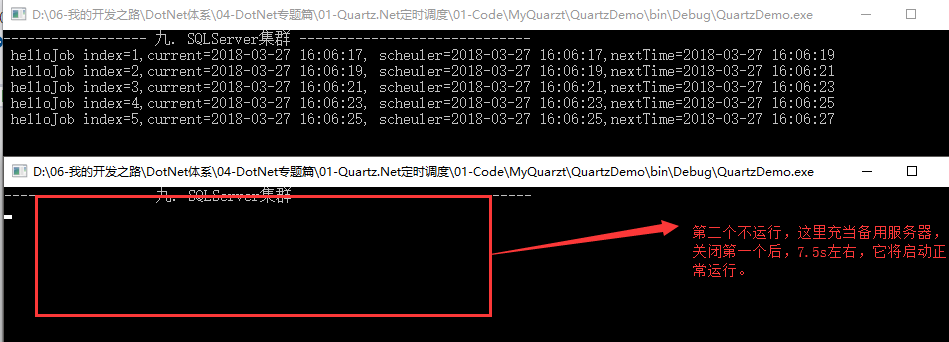

## 第十节: 利用SQLServer实现Quartz的持久化和双机热备的集群模式

------

> **背景：** 默认情况下，Quartz.Net作业是持久化在内存中的，即 quartz.jobStore.type = "Quartz.Simpl.RAMJobStore, Quartz"，这种模式有以下弊端：
>
> ① 想在A服务器上控制B服务器上已经发布了的job和trigger不方便；
>
> ② 很难实现Web端(寄宿在IIS上)管理作业，客户端(发布成服务)的这种模式。
>
> ③ 最大弊端就是一旦服务器宕机或者重启，调度器Schdeuler对应的所有作业（job、trigger及其对应关系）将丢失，不得不重新发布；

 **解决方案：**

　　针对问题1. 可以借助Remote代理的模式，通过TCP协议在A服务器上直接获取B服务器上的Scheduler，然后进行操作。([详情点击](http://www.cnblogs.com/yaopengfei/p/8573628.html))

　　针对问题2. 客户端作为Server端进行调度的执行，Web端通过Remote模式获取客户端的中的Scheduler，然后进行作业的管理，**问题是一旦客户端端挂机，Web端是连接不上的**。

　　针对问题3. 无论代理还是不代理，只要Server端一挂机，保存在内存中的作业都会丢失，所以这个时候，我们需要另辟蹊径，将作业持久化进行迁移，比如迁移到数据库中，这样话，即使服务器宕机，数据库中存储的作业信息仍然存在，下次只需要开启Scheduler即可，无须配置job和trigger了，同时也解决了上述问题1和问题2，即都可以直接修改数据库即可。

**该章节也是为开篇提出的目标三铺最后一道路，下面着重介绍持久化SQLServer数据库。**

**步骤1：准备数据库脚本。**

　　下载地址为：https://github.com/quartznet/quartznet/blob/master/database/tables/tables_sqlServer.sql，执行后的数据库如下图：


**重点介绍一下以上表的含义：**

　　qrtz_blob_triggers : 以Blob 类型存储的触发器。 

　　qrtz_calendars：存放日历信息， quartz可配置一个日历来指定一个时间范围。 

　　qrtz_cron_triggers：存放cron类型的触发器。 

　　qrtz_fired_triggers：存放已触发的触发器。 

　　qrtz_job_details：存放一个jobDetail信息。 

　　qrtz_job_listeners：job**监听器**。 

　　qrtz_locks： 存储程序的悲观锁的信息(假如使用了悲观锁)。 

　　qrtz_paused_trigger_graps：存放暂停掉的触发器。 

　　qrtz_scheduler_state：调度器状态。 

　　qrtz_simple_triggers：存放简单触发器的信息。 

　　qrtz_trigger_listeners：触发器监听器。 

　　qrtz_triggers：将Trigger和job进行关联的表。

注：cron方式需要用到的4张数据表： qrtz_cron_triggers，qrtz_fired_triggers，qrtz_job_details，qrtz_triggers。

**步骤2：代码进行持久化数据库配置**

　　需要配置的信息有SQLServer版本、数据库连接字符串、存储类型、数据源名称、驱动类型，代码如下：

[](javascript:void(0);)

```c#
 1            var properties = new NameValueCollection();
 2             //SQLServer版本
 3             properties.Add("quartz.dataSource.myDS.provider", "SqlServer-20");
 4             //表名前缀(可有可无)
 5             //properties.Add("quartz.jobStore.tablePrefix", "QRTZ_");
 6             //数据库连接字符串
 7             properties.Add("quartz.dataSource.myDS.connectionString", "Data Source=.;Initial Catalog=quartz;User ID=sa;Password=123456");
 8             //properties.Add("quartz.dataSource.myDS.connectionString", "Server =.;Database = quartz;Trusted_Connection =True;"); 
 9             //JobStore设置（JobStoreTX: 带有事务；JobStoreCMT：不带有事务）
10             //存储类型
11             properties.Add("quartz.jobStore.type", "Quartz.Impl.AdoJobStore.JobStoreTX, Quartz");
12             //数据源名称
13             properties.Add("quartz.jobStore.dataSource", "myDS");
14             //驱动类型
15             properties.Add("quartz.jobStore.driverDelegateType", "Quartz.Impl.AdoJobStore.StdAdoDelegate, Quartz");
```

[](javascript:void(0);)

**步骤3：向数据库中持久化作业，并开启调度。**

**代码如下：**

[](javascript:void(0);)

```c#
 1            var factory = new StdSchedulerFactory(properties);
 2             IScheduler scheduler = factory.GetScheduler();
 3             var job = JobBuilder.Create<HelloJob4>()
 4                                 .WithIdentity("ypfJob1", "ypfJobGroup1")
 5                                 .Build();
 6             var trigger = TriggerBuilder.Create()
 7                                  .WithIdentity("ypfTrigger1", "ypfTriggerGroup1")
 8                                 .WithCronSchedule("/3 * * * * ?")
 9                                 .Build();
10             if (!scheduler.CheckExists(job.Key))
11             {
12                 scheduler.ScheduleJob(job, trigger);
13             }
14             scheduler.Start();
```

[](javascript:void(0);)

**运行结果为：**

 

**此时分析数据库中的数据：**

**QRTZ_CRON_TRIGGERS** 表：即存放cron类型的trigger


 **QRTZ_JOB_DETAILS** 表：即存放job的信息

 

**QRTZ_TRIGGERS** 表：将Trigger和job进行关联的表


 **QRTZ_FIRED_TRIGGERS** 表：

 

**下面做几个实验，验证持久化问题：**

 **实验1：去掉代码中job和trigger的创建及关联，直接进行调度器的启动。**

 

**实验结果：调度正常按照每3s执行一次，证明作业持久化数据库成功。**

 

**实验2：修改数据库中的cron表达式为每5s执行一次，然后保持实验1中的代码注释，运行代码。**

 

**实验结果：调度变为每隔5s执行一次了，证明作业持久化数据库成功。**

 

**实验3：我们在上面的数据库表中发现一个现象，第一个字段都为Sched_Name，即调度器的名称，而且默认都为QuartzScheduler，那么如何增加多个不同名称的调度器呢？获取的时候又是怎么获取指定的调度器呢？都是通过下面的这句代码配置：**

```
properties.Add("quartz.scheduler.instanceName", "Ypf1Scheduler");
```

 **分享完整代码：**

[](javascript:void(0);)

```c#
            var properties = new NameValueCollection();
            //SQLServer版本
            properties.Add("quartz.dataSource.myDS.provider", "SqlServer-20");
            //表名前缀(可有可无)
            //properties.Add("quartz.jobStore.tablePrefix", "QRTZ_");
            //数据库连接字符串
            properties.Add("quartz.dataSource.myDS.connectionString", "Data Source=.;Initial Catalog=quartz;User ID=sa;Password=123456");
            //properties.Add("quartz.dataSource.myDS.connectionString", "Server =.;Database = quartz;Trusted_Connection =True;"); 
            //JobStore设置（JobStoreTX: 带有事务；JobStoreCMT：不带有事务）
            //存储类型
            properties.Add("quartz.jobStore.type", "Quartz.Impl.AdoJobStore.JobStoreTX, Quartz");
            //数据源名称
            properties.Add("quartz.jobStore.dataSource", "myDS");
            //驱动类型
            properties.Add("quartz.jobStore.driverDelegateType", "Quartz.Impl.AdoJobStore.StdAdoDelegate, Quartz");

            //Scheuler的名称，用于处理多个调度器的情况（指定和获取都是用这句代码，如果不指定的话，默认均为QuartzScheduler名称）
            {
                properties.Add("quartz.scheduler.instanceName", "Ypf1Scheduler");
            }

            var factory = new StdSchedulerFactory(properties);
            IScheduler scheduler = factory.GetScheduler();

            var job = JobBuilder.Create<HelloJob4>()
                                .WithIdentity("ypfJob1", "ypfJobGroup1")
                                .Build();
            var trigger = TriggerBuilder.Create()
                                 .WithIdentity("ypfTrigger1", "ypfTriggerGroup1")
                                .WithCronSchedule("/10 * * * * ?")
                                .Build();
            //Scheduler只要存在相同的job名称，将不在关联 （这里需要根据实际要求来处理）
            if (!scheduler.CheckExists(job.Key))
            {
                scheduler.ScheduleJob(job, trigger);
            }

            scheduler.Start();
```

[](javascript:void(0);)

**发现数据中上述的几张表中多了一条数据：**

 


 

　　**PS：前面有博友【 [搵中求胜](http://www.cnblogs.com/ycbt/)】给我留言提示集群的问题，这里借助他的话给大家一个提醒：**

　　**在使用** Quartz.Impl.AdoJobStore **做集群时，一旦出现连接超时或者底层的SQL错误，这个Job将彻底堵住，即使数据库连接恢复该JOB也得不到恢复，继承自IJob的Execute方法将不会被调用。**

**因此，必须有一个Timer对这些超时未执行的Job做重置或者移除再加入（切误参考网上DEMO做一个Manager继承IJob，因为Manager也被堵住了）**

 

二. 双机热备的集群模式

集群的两种形式：

　　1.读写分离：即master - slave，在SQLServer通过“发布-订阅”来实现，写是落库到master，读从slave中，一个主多个从。

　　2.双机热备：即一主多备，高可用，主挂掉了，备会自动顶上去， Quartz.Net集群采用的就是这种形式（备用服务启动，最短大约需要7.5s）。

配置代码在持久化的基础上多了两句：

　　properties["quartz.jobStore.clustered"] = "true";
　　properties["quartz.scheduler.instanceId"] = "AUTO";

 **下面分享完成的一段代码：**

[](javascript:void(0);)

```c#
 1   var properties = new NameValueCollection();
 2 
 3             properties["quartz.dataSource.sqlserver.provider"] = "SqlServer-20";
 4             properties["quartz.dataSource.sqlserver.connectionString"] = @"Data Source=.;Initial Catalog=quartz;User ID=sa;Password=123456";
 5             properties["quartz.jobStore.type"] = "Quartz.Impl.AdoJobStore.JobStoreTX, Quartz";
 6             //注意这个名字改为了sqlserver，上面的都要跟着改，也可以改为别的名
 7             properties["quartz.jobStore.dataSource"] = "sqlserver";
 8             properties["quartz.jobStore.driverDelegateType"] = "Quartz.Impl.AdoJobStore.SqlServerDelegate, Quartz";
 9 
10             //cluster 集群指定
11             properties["quartz.jobStore.clustered"] = "true";
12             properties["quartz.scheduler.instanceId"] = "AUTO";
13 
14             //Scheuler的名称，用于处理多个调度器的情况（指定和获取都是用这句代码，如果不指定的话，默认均为QuartzScheduler名称）
15             {
16                 properties.Add("quartz.scheduler.instanceName", "QuartzSchoolScheduler");
17             }
18 
19             var factory = new StdSchedulerFactory(properties);
20             var scheduler = factory.GetScheduler();
21             var job = JobBuilder.Create<HelloJob4>()
22                                 .WithIdentity("job3", "jobGroup3")
23                                 .Build();
24             //trigger   2s执行一次
25             var trigger = TriggerBuilder.Create()
26                                         .WithIdentity("trigger3", "triggerGroup3")
27                                         .WithSimpleSchedule(x => x.WithIntervalInSeconds(2).RepeatForever())
28                                         .Build();
29             var isExists = scheduler.CheckExists(job.Key);
30             if (!isExists)
31             {
32                 //开始调度
33                 scheduler.ScheduleJob(job, trigger);
34             }
35             scheduler.Start();
```

[](javascript:void(0);)

**数据库表的变化：**

 **QRTZ_SIMPROP_TRIGGERS 表：  （与cron的trigger存放的位置不同）**


 **QRTZ_JOB_DETAILS 表：**

 

 **QRTZ_TRIGGERS 表：**


 **QRTZ_FIRED_TRIGGERS 表：**

 

**运行结果：**

 　**生成一下代码，直接在bin文件里打开，然后再打开一个，发现第一个正常运行，第二个不运行。**

 

　　**关闭第一个客户端，7.5s后发现第二个正常启动运行，验证双机热备。**

 

 

 