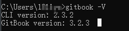
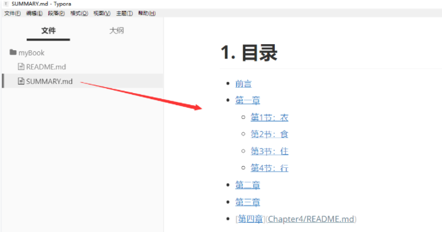
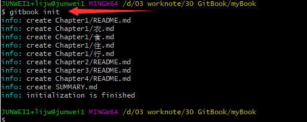
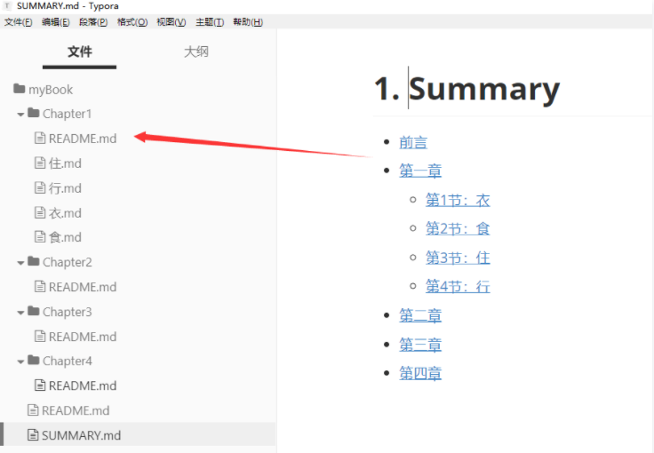
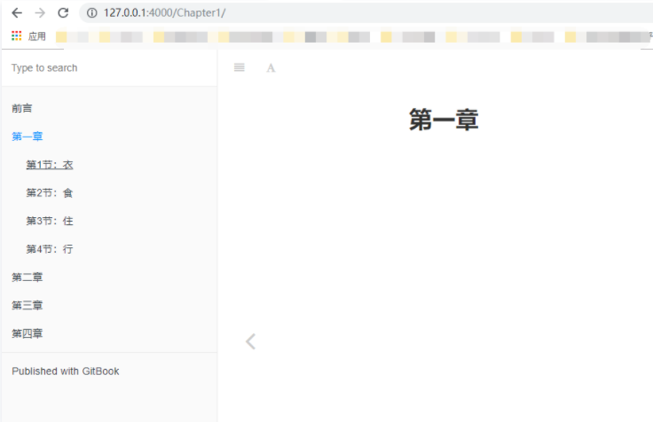
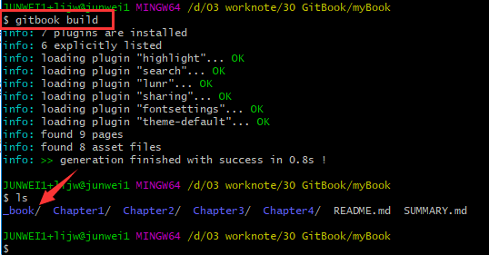
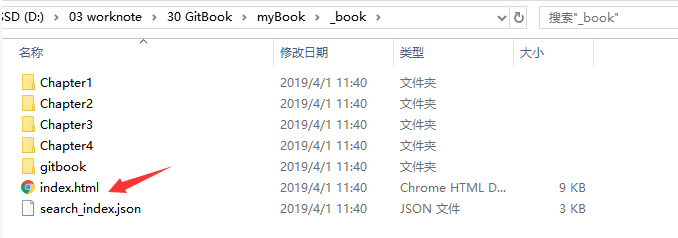
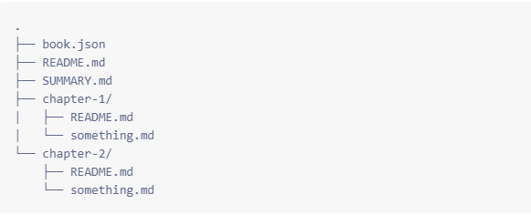

## GitBook+Typora使用教程

------

### 1.安装node.js

因为 GitBook 是基于 Node.js，所以我们首先需要安装 Node.js

### 2.使用npm安装gitbook

现在安装 Node.js 都会默认安装 npm（node 包管理工具），所以我们不用单独安装 npm，打开命令行，执行以下命令安装 GitBook：

```
npm install -g gitbook-cli
```

安装后查看是否成功：



### 3.初始化GitBook

新建文件夹mybook，命令行切换到该目录下，执行命令：**gitbook init**，执行完后，你会看到多了两个文件 —— README.md 和 SUMMARY.md，它们的作用如下：

- README.md —— 书籍的介绍写在这个文件里
- SUMMARY.md —— 书籍的目录结构在这里配置

使用Typora来编写框架内容，编辑 SUMMARY.md 文件，内容修改为：

```
# 目录

* [前言](README.md)
* [第一章](Chapter1/README.md)
  * [第1节：衣](Chapter1/衣.md)
  * [第2节：食](Chapter1/食.md)
  * [第3节：住](Chapter1/住.md)
  * [第4节：行](Chapter1/行.md)
* [第二章](Chapter2/README.md)
* [第三章](Chapter3/README.md)
* [第四章](Chapter4/README.md)
```

显示如下：



重新使用gitbook根据目录，初始化篇章

然后我们回到命令行，在 mybook 文件夹中再次执行 **`gitbook init`** 命令。GitBook 会查找 SUMMARY.md 文件中描述的目录和文件，如果没有则会将其创建。



Typora 是所见即所得（实时渲染）的 Markdown 编辑器，这时候它是这样的：



### 4.启动服务，预览书籍

接着我们执行 `gitbook serve` 来预览这本书籍，执行命令后会对 Markdown 格式的文档进行转换，默认转换为 html 格式，最后提示 “Serving book on [http://localhost:4000](https://links.jianshu.com/go?to=http%3A%2F%2Flocalhost%3A4000%2F)”。嗯，打开浏览器看一下吧：



### 5.构建书籍

当你写得差不多，你可以执行`gitbook build`命令构建书籍，默认将生成的静态网站输出到`_book`目录。实际上，这一步也包含在`gitbook serve`里面，因为它们是 HTML，所以 GitBook 通过 Node.js 给你提供服务了。





## 补充：

1. ## book.json 




存放配置信息，格式如下：

```
{
    "plugins": [
        "-lunr", "-search", "search-pro",
        "back-to-top-button",
        "chapter-fold",
        "code",
        "splitter",
        "tbfed-pagefooter",
        "page-treeview",
		"intopic-toc",
		"summary"
    ],
    "pluginsConfig": {
        "tbfed-pagefooter": {
            "copyright": "Copyright &copy Aron.Li 2019",
            "modify_label": "该文件修订时间：",
            "modify_format": "YYYY-MM-DD HH:mm:ss"
        },
        "page-treeview": {
            "copyright": "Copyright &#169; aleen42",
            "minHeaderCount": "2",
            "minHeaderDeep": "2"
        }
    }
}
```

2.图片问题

