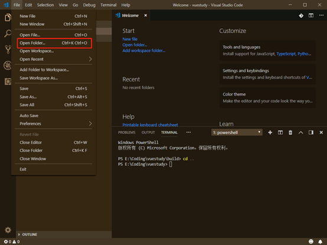
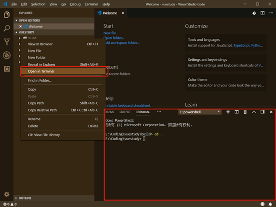

## vue+vscode+nodejs 开发环境搭建

------

**nodejs****安装配置**

**1.****下载**

地址：https://nodejs.org/en/

**2.****默认安装**

 

 

安装完成后，执行npm -v 出现版本号则表示安装成功。

**3.****配置**

- 在node安装目录下新建两个文件夹node_global和node_cache
- 配置npm全局模块的存放路径以及cache的存放路径，执行如下命令：

npm config set prefix "D:\Program Files\nodejs\node_global"

npm config set prefix "D:\Program Files\nodejs\node_cache"

- 配置环境变量，增加变量

NODE_PATH   D:\Program Files\nodejs\node_global\node_modules

NODEJS_PATH  D:\Program Files\nodejs

PATH 追加%NODEJS_PATH%\;%NODEJS_PATH%\node_global\

- 安装cnpm，执行如下命令：

npm install -g cnpm --registry=[https://registry.npm.taobao.org](https://registry.npm.taobao.org/)

- 安装js格式校验插件eslint

cnpm install eslint -g

**VSCode****安装配置**

**1.****下载**

地址：https://code.visualstudio.com/Download

**2.****默认安装**

**3.****插件安装**

- Auto Close     Tag
- Auto     Rename Tag
- Beautify
- Chinese
- CSS peek
- Document     This
- ESlint
- filesize
- Gitlens-Git     supercharged
- HTML CSS     support
- HTML     snippets
- Java     Server pages
- Language     Support for Java
- Live     server
- open in     browser
- Path     Autocomplete
- Path     Intellisense
- PostCSS     syntax
- postcss-sugarss-language
- Vetur
- VS Code     CSS Comments
- vscode-icons
- Vue 2     Snippets
- VueHelper
- vscode-element-helper

**3.****配置**

修改配置如下：

{

"css.validate": false,

// "files.associations": {

// "*.css": "postcss"

// },

"emmet.includeLanguages": {

"vue-html": "html",

"javascript": "javascriptreact",

"postcss": "css"

},

"git.path":"E:/Program Files/Git/bin/git.exe",

"git.autoRepositoryDetection": false,

"workbench.iconTheme": "vscode-icons",

//自动补齐文件路径时，带入扩展名

"path-autocomplete.extensionOnImport": true,

// 每次保存文件（ctrl+s）时，eslint插件会自动对当前文件进行eslint语法修正！

"eslint.validate": [

"javascript",

"javascriptreact",

"html",

{

"language": "vue",

"autoFix": true

}

],

"eslint.options": {

"plugins": [

"html"

]

},

//为了符合eslint的两个空格间隔原则

"editor.tabSize": 2,

// 启用/禁用 HTML 标记的自动关闭。

"html.autoClosingTags": true,

// 启用后，按下 TAB 键，将展开 Emmet 缩写。

"emmet.triggerExpansionOnTab": true,

// 以像素为单位控制字号。

"editor.fontSize": 16,

"[postcss]": {},

"git.enableSmartCommit": true,

"liveServer.settings.host": "172.30.201.16",

"liveServer.settings.donotShowInfoMsg": true,

"gitlens.advanced.messages": {

"suppressShowKeyBindingsNotice": true

},

"explorer.confirmDelete": false,

"vsicons.dontShowNewVersionMessage": true

} 

**vue****安装和初始化**

**1.****安装**

执行命令：**cnpm install -g vue-cli**

**2.****搭建****vue****项目并初始化**

- 执行命令**：****vue init webpack my-project**
- 根据提示输入内容 

 

- 使用vscode打开项目 

 

- 右键项目，在终端中打开 

 

- 移动到项目根目录

cd ..

- 安装依赖

**cnpm install**

- 启动项目

**cnpm run dev**

 

**结果如下：**

 

 

