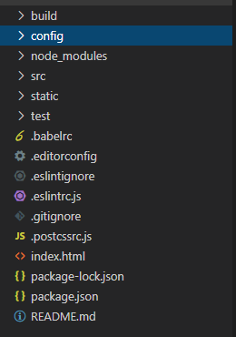

## vue安装及配置

------

首先下载node.js要求版本在8.9以上    官网：[https://nodejs.org/zh-cn/](https://links.jianshu.com/go?to=https%3A%2F%2Fnodejs.org%2Fzh-cn%2F)

下载完可检查在windows任务命令行里输入node -v

使用淘宝NPM镜像源下载比较快  命令：npm install -g cnpm --registry=[https://registry.npm.taobao.org](https://links.jianshu.com/go?to=https%3A%2F%2Fregistry.npm.taobao.org%2F)

安装vue-cli（全局安装vue-cli）  命令：cnpm install vue-cli -g

检查环境是否安装上：vue -V

创建vue项目：

在命令行里输入命令：vue init webpack vue_demo（创建名字为‘vue_demo’的文件夹）

 然后进入此文件夹：cd vue_demo

 然后手动下载：cnpm install

最后运行程序：npm run dev    

运行之后会导出网址：http://localhost:8080

在网页上输入上面的网址即可

 

vue-cli总共提供了5种脚手架(即可使用的<template-name>)，分别如下。

webpack：基于webpack和vue-loader的目录结构，而且支持热部署、代码检查、测试及css抽取。

webpack-simple：基于webpack和vue-loader的目录结构。

browerify：基于Browerfiy和vueify（作用于vue-loader类似）的结构，支持热部署、代码检查及单元测试。

browerify-simple：基于Browerfiy和vueify的结构。 

simple：单个引入Vue.js的index.html页面。

 

这里我们主要会使用webpack作为常用脚手架，可以运行vue init webpack my-project来生成项目。[插图]图生成的目录结构如下所示。

build：用于存放webpack相关配置和脚本。

config：主要存放配置文件，用于区分开发环境、测试环境、线上环境的不同。

src：项目源码及需要引用的资源文件。

static：不需要webpack处理的静态资源。

test：用于存放测试文件。

从package.json中，我们可以看到项目支持的命令有：

正常开发时，就会运行命令npm run dev，启动一个小型的express服务。在这个express服务中，会使用webpack-dev-middleware和webpack-hot-middleware这两个中间件，来进行项目的热部署，即每次修改src中的文件后，不需要再按浏览器的刷新来更新代码，启动的server服务会自动监听文件的变化并编译，通知浏览器自动刷新。