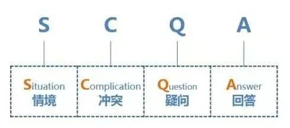
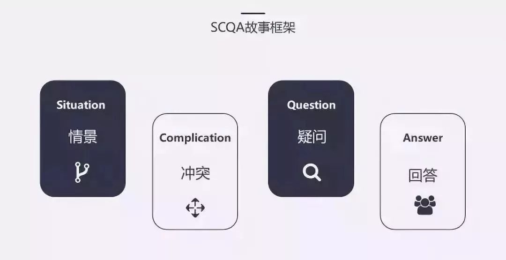
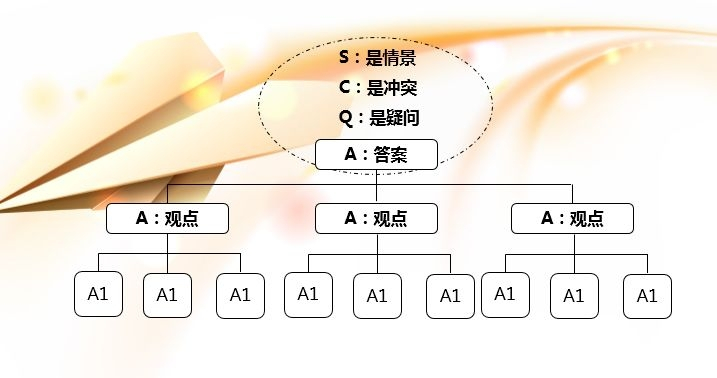
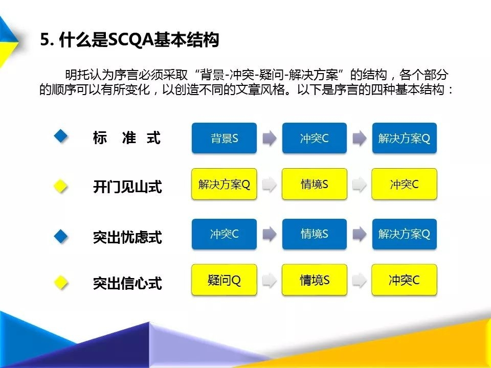

## **不是没有重点，是没有结构——SCQA架构**

------

使用结构化表达工具——SCQA架构，有意识地训练自己有效表达观点、突出重点。

某员工要向老板汇报工作，非常紧张，连夜准备了40多页PPT。

可是刚讲到第二页，就感觉到老板有点儿不耐烦了。讲到第五页的时候，老板打断说:“不要讲PPT了， 直接说重点。”

该员工当场就蒙了，杵在那里，站也不是，坐也不是。

为什么会这样?老板不满意，真的是因为员工的报告没有重点吗?员工很委屈，觉得自己说的都是重点。

其实老板不满意，并不一定是因为员工的报告没有重点，而是在员工没有受过结构化表达训练的混乱陈述中，抓不到重点。

什么是结构化表达?芭芭拉·明托在《金字塔原理》这本书中，除了提出MECE法则之外，还提出一个结构化表达工具: SCQA架构。

S，即情境(situation);C，即冲突( complication);Q，即问题(question);A，即答案( answer )

在《5分钟商学院·个人篇》中提到的“起承转合五步法”场景导入、打破认知、核心逻辑、举一反三、回顾总结，其实就是基于一个常用的SCQA架构“标准式”(SCA) :情境——冲突——答案。

“满怀激情地跟客户聊了很久，介绍了半天产品，他也确实很心动，似乎什么都好，但最后还是觉得太贵了。”——“心理账户”的概念背景，也就是S。

“真的是因为客户小气吗?你可能会发现，他的包、他的表都很奢华。小气和大方是相对的。有没有什么办法可以让这些所谓小气的客户变得大方呢?”一一常识冲突，也就是C。

“那我们就来讲讲小气和大方背后的商业逻辑。”——给出答案，也就是A。

芭芭拉明托的结构化表达工具SCQA架构，还可以变形组合出其他模式，帮助我们在很多沟通场合，比如演讲、汇报、写作时，有效地表达观点。

开门见山式(ASC) :答案一情境—冲突

回到最初的案例，员工可以试着这么报告:“今天我要报告的，是关于把公司的销售激励制度，从提成制改为奖金制的提议。”——这就是开门见山，直接抛出答案。

“公司从创始以来，一直使用提成制来激励销售队伍。这是三大主流激励机制( 提成、奖金、分红)中的一种，三种激励机制分别适用于不同的场景。”——这就是情境，对激励制度做一个完整的介绍。

“但是，提成制在公司业务迅猛发展，覆盖地市越来越多的情况下，造成了很多激励上的不公平:富裕地区和贫穷地区的不公平、成熟市场和新进入市场的不公平，甚至出现员工拿到大笔提成，但公司却亏损的状态。”——用“答案一情境一冲突”开门见山地和老板沟通，第一句就是重点。

突出忧虑式(CSA):冲突一情境一答案

突出忧虑式的关键在于强调冲突，引导听者的忧虑，从而激发其对情境的关注，以及对答案的兴趣。医生常用这一模式。

“哎哟，你病得不轻啊!”——这就是冲突。听到这句话，估计没有人心里不咯噔一下。

“还好， 能治。美国刚刚有一项最新研究成果，通过了FDA(食品药品监督管理局)认证。”——这就是情境。听到这句话，一颗悬到嗓子眼的心，总算是放下来了。

“就是...有点儿贵。”——这就是答案。这时候，估计再贵，病人也无所谓了。

突出信心式(QSCA) :问题一情境一冲突一答案

“今天全人类面临的最大威胁是什么?”——这是一个问题。“在过去的几十年，科技高速发展，人类拥有的先进武器完全可以摧毁地球几十次。”——这是一个情境。

“但是，我们拥有摧毁地球的能力，却没有逃离地球的方法。”——这是一个冲突。

“所以，我们今天面临的最大威胁，是没有移民外星球的科技。我们公司将致力于私人航天技术，在可预见的未来，实现火星移民计划。”——这是一个答案。

画重点：SCQA架构

这是一种结构化表达工具，用标准式(SCA)、开门见山式(ASC)、突出忧虑式CSA)和突出信心式(OSCA)提高表述的结构性，突出重点。