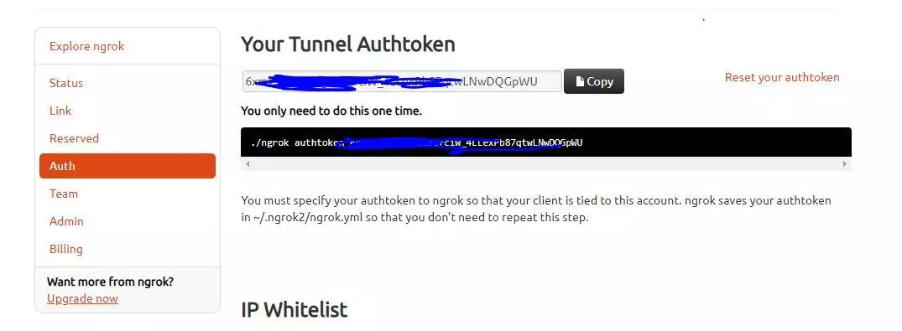
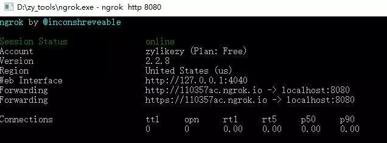

## ngrok的使用

------

**ngrok的使用步骤如下：**

**1. 进入ngrok官网（**[**https://ngrok.com/**](https://ngrok.com/)**），注册ngrok账号并下载ngrok；**

**2. 根据官网给定的授权码，运行如下授权命令；**

授权码

授权命令

ngrok authtoken 授权码

授权码和账户是绑定的，在授权命令运行后，ngrok会将授权码保存在~/.ngrok2/ngrok.yml中，所以只需要运行一次，以后都可以使用。

**3. 根据需要，运行命令开发端口。**

ngrok http 8080

需要注意的是，这里的端口8080可以根据需要替换成其他端口。这条命令的意思是将本地8080端口对应的服务暴露到外网中。

运行后将出现如下结果：

Forwarding，第一个是http协议对应的外网地址，第二个是https协议对应的外网地址。这样，凡是访问http://110357ac.ngrok.io的请求都将发送到localhost:8080。

**4.其他**

**每次启动ngrok都会分配一个新的外网域名，所以需要每次更换配置或者更换访问地址，不太方便。当然，ngrok也提供了解决方法，那就是付费，可以设置固定域名。**